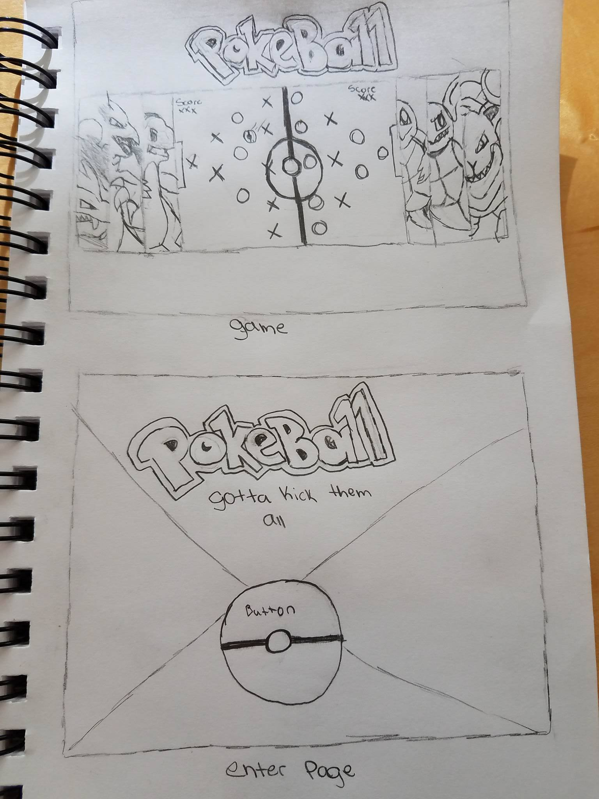

# PokeBall

[http://retailer-antennas-51271.bitballoon.com/](URL)

#overview  
I built a game where you control each character like you would in foosball. When the page first loads the players are greeted with a welcoming page where you insert your name and press a button to start the game. while playing there is a option to have background music. The canvas will appear with the score on the right and left hand bottom corners. once a player reaches 3 a winners window will pop up.From there you are able to play again by clicking "play again".
# Technologies Used
HTML, CSS, Javascript
jquery
Atom
Google fonts

#WireFrame

#links
PokeBall[http://retailer-antennas-51271.bitballoon.com](URL)
